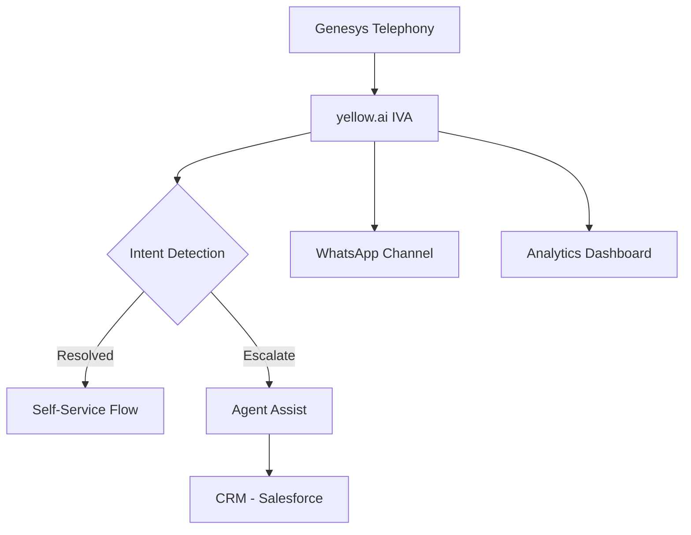

# JARVIS — Autonomous AI Sales Assistant

JARVIS is a 24/7 autonomous sales intelligence system. It runs in the background and makes Claude (Desktop, Code, CoWork) and OpenCode aware of every account you're working on. Chat naturally — JARVIS captures everything, updates battlecards, proposals, discovery notes, and risk reports automatically.

---

## Setup (One Time)

```bash
git clone https://github.com/younussshaik5/Personal-AE-SC-Jarvis.git
cd Personal-AE-SC-Jarvis

# Copy and fill in your API key
cp .env.template .env
# Edit .env → add NVIDIA_API_KEY

# Start JARVIS
./start_jarvis.sh
```

JARVIS auto-wires itself to Claude Desktop, Claude Code, and OpenCode on every start. No manual config editing.

---

## How to Use It — Step by Step

### Step 1 — Start JARVIS

```bash
./start_jarvis.sh
```

This starts 3 processes:
- **JARVIS Core** — the brain (skill engine, file watcher, event bus)
- **MCP Server** — the bridge between Claude/OpenCode and JARVIS
- **Dashboard** — http://localhost:8080

### Step 2 — Open an Account Folder in Claude or OpenCode

This is the key step. **You must open the account folder as your workspace**, not just mention the account name in chat.

---

## Opening Account Folders in Each Interface

### Claude Desktop (CoWork / Chat)

1. Open Claude Desktop
2. Click the **folder icon** in the top-left (CoWork)
3. Navigate to `~/JARVIS/ACCOUNTS/`
4. Open the account folder, e.g. `~/JARVIS/ACCOUNTS/TataPlay/`
5. Start chatting — JARVIS context loads automatically

> Claude now sees `TataPlay/.claude/CLAUDE.md` which tells it to automatically save conversations, use discovery tools, and trigger skill regeneration.

---

### Claude Code (CLI)

```bash
cd ~/JARVIS/ACCOUNTS/TataPlay
claude
```

Or open a new Claude Code session from inside the folder. The `.claude/CLAUDE.md` file in that folder activates all JARVIS auto-rules.

---

### OpenCode

1. Open OpenCode
2. `File → Open Folder` → navigate to `~/JARVIS/ACCOUNTS/TataPlay/`
3. Chat in the conversation panel — JARVIS MCP is active

---

## What Actually Happens When You Chat

Every account folder (`~/JARVIS/ACCOUNTS/TataPlay/`) contains a hidden `.claude/CLAUDE.md` file that JARVIS generates automatically. This file instructs Claude to:

- Save every conversation turn to JARVIS
- Call the right tools when you mention discovery, battlecard, ROI, etc.
- Trigger background skill regeneration after significant updates

Here's the pipeline:

```
You chat in TataPlay/ folder
      ↓
Claude reads TataPlay/.claude/CLAUDE.md (auto-loaded)
      ↓
Claude calls jarvis_save_conversation() → saves to JARVIS_BRAIN.md
      ↓
JARVIS Core detects the update → extracts signals
      ↓
Skill fires → regenerates battlecard.md / discovery / proposal
      ↓
Files updated in ACCOUNTS/TataPlay/ within 30–60 seconds
```

---

## Real Examples — Sales (AE Role)

### Example 1 — Post-Discovery Call

You just got off a 45-min discovery call with TataPlay. Open Claude Code in their folder:

```bash
cd ~/JARVIS/ACCOUNTS/TataPlay
claude
```

You type:
> "Call was with Priya (VP Operations) and Rahul (IT Head). Pain: agents handling 80k calls/day manually, CSAT at 62%. Budget: ₹2Cr approved for FY26. Decision by June. Competitor: Freshdesk already demoed."

**What JARVIS does automatically:**

1. `jarvis_save_conversation(account="TataPlay", role="user", content=<your message>)` — saves to brain
2. `jarvis_update_discovery(account="TataPlay", notes=<notes>, attendees="Priya, Rahul", pain_points="80k manual calls, CSAT 62%", budget_signal="₹2Cr FY26", champion="Priya")` — appended to `DISCOVERY/final_discovery.md`
3. `jarvis_trigger_skill(account="TataPlay", skill="demo_strategy")` — demo strategy regenerates with Freshdesk competitive angle
4. `jarvis_trigger_skill(account="TataPlay", skill="value_architecture")` — ROI model built around ₹2Cr budget, 80k calls baseline
5. `jarvis_trigger_skill(account="TataPlay", skill="battlecard")` — Freshdesk vs JARVIS battlecard refreshed

**30 seconds later, these files are updated:**
- `ACCOUNTS/TataPlay/BATTLECARD/battlecard.md` — Freshdesk trap questions, our differentiators
- `ACCOUNTS/TataPlay/DEMO_STRATEGY/demo_strategy.md` — demo flow targeting Priya's CSAT pain
- `ACCOUNTS/TataPlay/VALUE_ARCHITECTURE/roi_model.md` — 3 ROI scenarios based on 80k calls

---

### Example 2 — Morning Pipeline Review

Open Claude Desktop → CoWork → `~/JARVIS/ACCOUNTS/` folder (the root)

You type:
> "What do I have today?"

Claude automatically:
1. `jarvis_get_pipeline()` — pulls all deals with stage + MEDDPICC score
2. Checks Google Calendar for today's meetings
3. `jarvis_prep_for_meeting(account="TataPlay")` for any meeting on calendar
4. `jarvis_get_notifications()` — any stale deals or overdue actions

**You get back:**
```
Today's briefing:

📅 Meetings:
  • 2pm — TataPlay demo (Priya, Rahul)
    → Pain: CSAT 62%, 80k calls/day
    → Demo tip: Lead with IVA deflection, not chatbot
    → Watch out: Freshdesk already demoed — hit SLA accuracy differentiator early
    → Champion: Priya (VP Ops) — budget approved ✓

⚠️ Stale deals (no activity >7 days):
  • Reliance Retail — last touch 12 days ago, stuck at "Proposal Sent"

🎯 Next actions:
  • TataPlay: send demo confirmation + agenda by 1pm
  • Reliance Retail: call Amit to unblock legal review
```

---

### Example 3 — Deal Review with Manager

You're prepping for a pipeline review. Open Claude Code in the TataPlay folder:

> "Give me the risk report for TataPlay"

Claude calls `jarvis_get_risk_report(account="TataPlay")` and returns:

```
# Risk Report — TataPlay

SE Activities: (2) Discovery, (1) Demo, (0) POC

Top 3 Use Cases:
1. IVA for inbound call deflection (80k/day)
2. Agent assist for CSAT improvement
3. WhatsApp automation for outbound

Stakeholders Met: Priya (VP Ops), Rahul (IT Head)
Champion: Priya ✓
Economic Buyer: Not met yet ⚠️

MEDDPICC Score: 5/8
Gaps: Economic Buyer (0), Paper Process (0), Decision Process (1)

Technical Risk: Integration with Genesys telephony — needs POC
```

You then say:
> "Append weekly update: Met Priya, confirmed POC scope. Genesys integration confirmed feasible. Economic buyer is CFO Suresh — intro call being arranged. SY 2026-03-31"

Claude calls `jarvis_update_risk_report(account="TataPlay", initials="SY", update=<your text>)` — appended, never overwrites.

---

## Real Examples — Presales (SC Role)

### Example 4 — RFI Response

Customer sent an RFI. Drop the PDF in the RFI folder:

```bash
cp ~/Downloads/TataPlay_RFI_2026.pdf ~/JARVIS/ACCOUNTS/TataPlay/RFI/
```

JARVIS detects the file drop → starts processing. Then in Claude:

> "Fill the RFI for TataPlay"

Claude calls `jarvis_fill_rfi(account="TataPlay")` and returns:
- `rfi_analysis.md` — every requirement mapped to our capabilities with gap analysis
- `rfi_responses.md` — draft responses to every question

---

### Example 5 — Architecture Diagram for Demo

Before a technical demo, open Claude Code in the account folder:

> "Show me the solution architecture for TataPlay"

Claude calls `jarvis_get_architecture_diagram(account="TataPlay")` and returns the Mermaid.js diagram inline:



Plus the HTML file path — open in browser for full interactive view with download.

> "Refresh the architecture — they mentioned they use AWS not Azure"

You say this → Claude calls `jarvis_trigger_skill(account="TataPlay", skill="architecture_diagram", reason="Customer confirmed AWS infrastructure")` → JARVIS regenerates with AWS components.

---

### Example 6 — Proposal Generation

> "Generate a proposal for TataPlay"

Claude calls `jarvis_get_proposal(account="TataPlay")`:
- Returns `proposal.html` path — open in browser
- All fields pre-filled from discovery data (Priya's pain, ₹2Cr budget, 3 modules)
- Edit pricing, discounts, add/remove line items in the browser
- Print to PDF directly from browser

---

### Example 7 — Competitive Battle During Demo

Mid-demo, customer asks: "How do you compare to Freshdesk?"

Open Claude (any interface) with TataPlay folder active:

> "Freshdesk comparison — quick"

Claude calls `jarvis_get_battlecard_full(account="TataPlay")` and returns instantly:

```
Top Differentiators vs Freshdesk:
1. Native voice IVA — Freshdesk requires 3rd party integration
2. Unified omnichannel (voice + chat + WhatsApp) — Freshdesk is chat-first
3. NVIDIA LLM reasoning for complex intents — Freshdesk uses basic NLP

Trap Questions to Ask:
• "How does Freshdesk handle 80k voice calls/day without IVA?"
• "What's their SLA for intent accuracy on regional languages?"

Win Probability: 72% (budget confirmed, champion strong, competitor weak on voice)
```

---

## Folder Structure Reference

```
~/JARVIS/
└── ACCOUNTS/
    └── TataPlay/
        ├── .claude/
        │   └── CLAUDE.md          ← auto-generated, tells Claude to use JARVIS tools
        ├── DISCOVERY/
        │   ├── discovery_prep.md  ← JARVIS-generated questions before call
        │   └── final_discovery.md ← your notes after each call (append-only)
        ├── BATTLECARD/
        │   └── battlecard.md      ← auto-refreshed after each discovery update
        ├── DEMO_STRATEGY/
        │   ├── demo_strategy.md   ← flow, use cases, narrative
        │   └── demo_script.md     ← line-by-line script
        ├── VALUE_ARCHITECTURE/
        │   ├── roi_model.md       ← 3 ROI scenarios (conservative/realistic/optimistic)
        │   └── tco_analysis.md    ← TCO vs competitors
        ├── PROPOSAL/
        │   └── proposal.html      ← open in browser, edit live
        ├── SOW/
        │   └── sow.md             ← 10-section scope of work
        ├── RISK_REPORT/
        │   └── risk_report.md     ← weekly deal risk (append-only)
        ├── ARCHITECTURE/
        │   └── architecture_diagram.html ← open in browser
        ├── MEETINGS/              ← drop recordings here
        ├── DOCUMENTS/             ← drop RFPs, contracts here
        ├── EMAILS/                ← paste email threads as .md
        ├── meddpicc.json          ← MEDDPICC scores (auto-updated)
        └── deal_stage.json        ← current stage
```

---

## Quick Command Reference

| You say | What happens |
|---|---|
| "brief me on TataPlay" | Full account dossier — stage, MEDDPICC, last activity, next step |
| "prep me for the TataPlay demo" | Meeting brief, demo strategy, battlecard summary |
| "save discovery notes: [notes]" | Appended to final_discovery.md, skills auto-refresh |
| "battlecard vs Freshdesk" | Full competitive card — differentiators, traps, objections |
| "generate proposal" | proposal.html created, open in browser |
| "risk report" | Weekly risk report pulled |
| "refresh demo strategy" | jarvis_trigger_skill fires, regenerated in 30s |
| "what do I have today?" | Calendar briefing + pipeline alerts + prep for today's meetings |
| "show pipeline" | All deals — stage, MEDDPICC score, days since last activity |

---

## Logs & Debugging

```bash
# Watch JARVIS activity in real-time
tail -f ~/JARVIS/logs/orchestrator.log

# Check which skills fired
grep "Skill trigger\|Component started\|task.*enqueued" ~/JARVIS/logs/orchestrator.log

# Stop JARVIS
kill $(cat .jarvis.pid .ui.pid .mcp_observer.pid 2>/dev/null)

# Restart
./start_jarvis.sh
```

---

## Requirements

- Python 3.11+
- Node.js 18+
- NVIDIA API key (for LLM features)
- Claude Desktop or Claude Code (for MCP tools)
