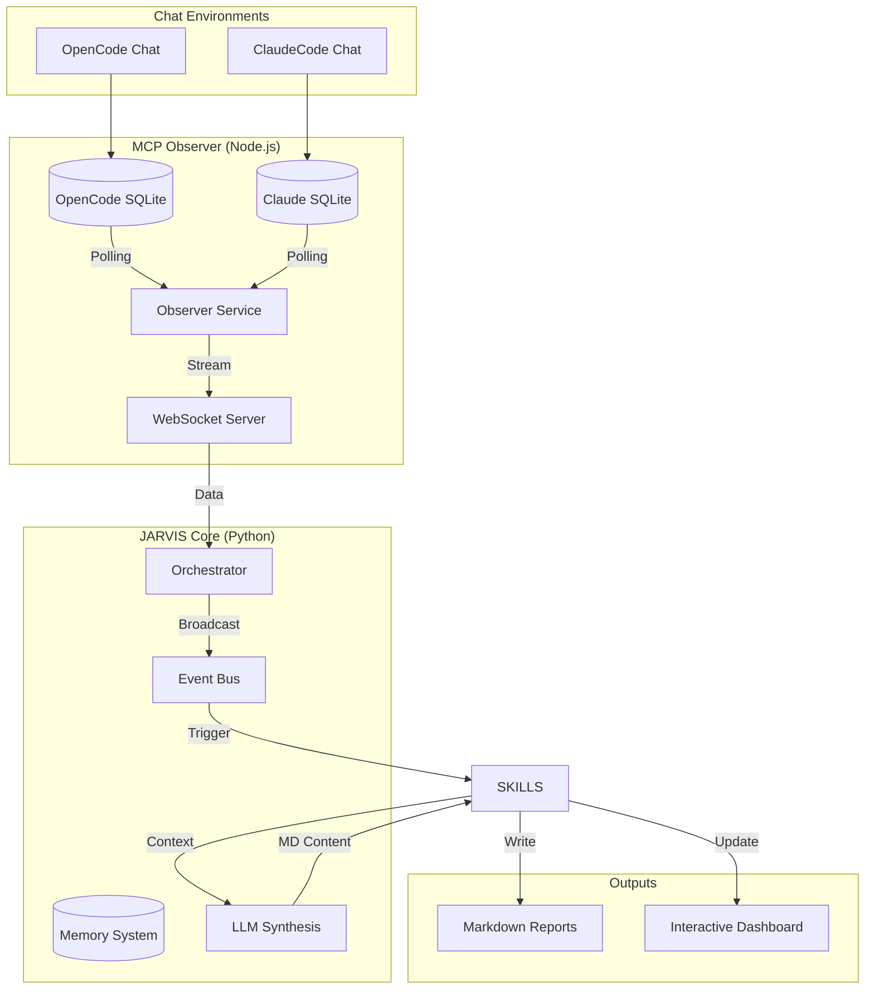
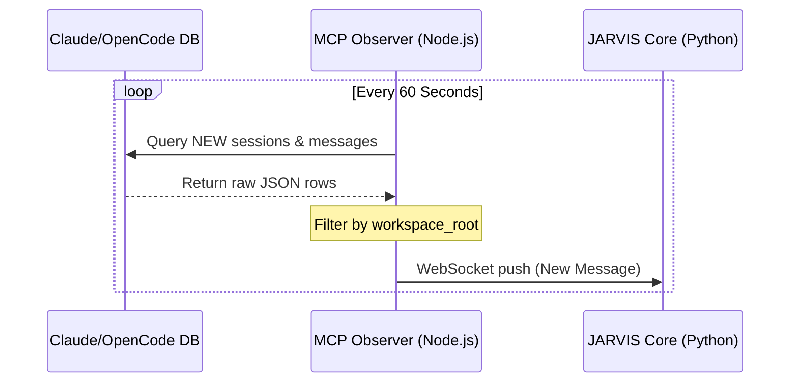
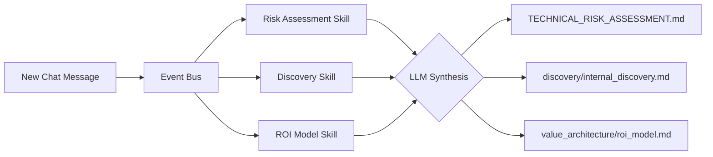

# JARVIS - Autonomous AI Professional (Sales & Presales Template)

[](https://opensource.org/licenses/MIT)
[](https://www.python.org/downloads/)

> **Welcome to the JARVIS Open-Source Template!**  
> This is a fully functional, self-evolving AI assistant designed specifically for **Account Executives (AEs)**, **Sales Reps**, **Solution Engineers (SEs)**, and **Presales** professionals. Fork this repository to run your own autonomous double locally.

---

## 🗺️ Project Architecture: Why, What, and How

### The "Why": Solving the Sales & Presales Documentation Gap
Sales professionals and Solution Engineers spend 30-40% of their time on tedious administrative tasks: summarizing meeting notes, drafting discovery docs, and filling out risk assessments. **JARVIS** was built to automate this by observing your real-world conversations and turning them into professional, high-impact business artifacts.

### The "What": High-Level System Design
JARVIS is a multi-layered autonomous system that bridges your AI chat environments with a professional documentation suite.



### The "How": Detailed Component Breakdown

#### 1. The Real-Time Observer Loop
The **MCP Observer** is the "eyes" of the system. It monitors your local conversation history without needing access to any cloud platform, ensuring your data stays private.



#### 2. The Skill Pipeline: Turning Chat into Strategy
When the Core receives a message, it doesn't just "summarize"—it uses specialized **Skills** to synthesize the data into different business lens (e.g., Risk, Discovery, MEDDPICC).



#### 3. Persistent Memory & Account Isolation
JARVIS organizes its knowledge using a structured directory system. Each account you specify has its own sandbox where documents are created and updated.

- **MEMORY/**: Stores global competitor data, common product patterns, and long-term user preferences.
- **ACCOUNTS/**: Contains the per-deal intelligence suite.

---

## 🚀 Quick Start: Post-Fork Setup

Congratulations on forking JARVIS! Follow these steps to make it work seamlessly in your local environment.

### 1. Install Dependencies
Navigate to the observer directory and install the required Node.js modules.
```bash
cd mcp-opencode-observer
npm install
```

### 2. Environment Configuration
Copy the example configurations and update them with your local paths.
- **Main Config**: `jarvis/config/jarvis.yaml`
- **Observer Config**: `mcp-opencode-observer/config/mcp-observer.json`

---

## 🤖 AI-Assisted Configuration & Repair

Because this project has a complex architecture (Python and Node.js working together), if you find any "broken" files or startup errors, you can have your AI assistant (ClaudeCode or OpenCode) fix them automatically.

### Recommended Prompt:
> "I have just forked this JARVIS AI template. 
> 1. Please first **analyze the entire project architecture** to understand how the MCP Observer and JARVIS Core interact.
> 2. Once you understand the system, perform the following setup:
>    - Update `mcp-opencode-observer/config/mcp-observer.json` with my local paths.
>    - Ensure the `dbPath` correctly points to my local OpenCode/Claude database.
>    - Run `npm install` in the observer directory.
>    - Fix any syntax or path errors you find to make the system fully functional."

---

## ✨ Key Capabilities

JARVIS acts as your autonomous double. Whatever you chat about in **ClaudeCode** or **OpenCode**, JARVIS synthesizes it in real-time.

- **🧠 Real-Time Conversation Synthesis** – Polls your chat history every 60s to extract customer interests, pain points, and technical requirements.
- **📝 Autonomous Document Generation** – Automatically creates and updates Technical Risk Assessments, Deep Discovery docs, MEDDPICC reports, ROI models, and Demo Strategies.
- **🎭 Multi-Persona Intelligence** – Detects if your conversation is deal-focused (AE) or technical (SC) and adjusts its output focus.
- **📊 Interactive Dashboards** – Aggregates all insights into a premium HTML interface with one-click exports to PDF, Word, and Excel.

---

## 📁 Generated Documents (Per Account)

Each opportunity under `ACCOUNTS/<team>/<Account Name>/` gets an automated intelligence suite:

```
├── DASHBOARD.html                 ← Master CRM-style view with exports
├── TECHNICAL_RISK_ASSESSMENT.md   ← LLM-synthesized risk analysis
├── discovery/
│   ├── internal_discovery.md      ← Deep technical dive
│   ├── final_discovery.md         ← Handoff summary
│   └── Q2A.md                     ← Questions to answer
├── meddpicc/
│   ├── qualification_report.md    ← MEDDPICC analysis
│   └── stakeholder_analysis.md    ← MAP/Champion tracking
├── battlecards/
│   ├── competitive_intel.md       ← Competitor deep-dives
│   └── pricing_comparison.md      ← Pricing vs market
├── value_architecture/
│   ├── roi_model.md               ← Financial impact analysis
│   └── tco_analysis.md            ← Total Cost of Ownership
├── demo_strategy/
│   ├── demo_strategy.md           ← Tailored demo flow
│   └── tech_talking_points.md     ← Key proof points
└── notes.json                     ← Raw facts & knowledge gaps
```

---

## 🔧 Advanced Configuration

### Persona Management
- To modify persona definitions, edit the files in `jarvis/persona/`.
- To add new rules for autonomous behavior, edit `mcp-opencode-observer/config/rules.yaml`.

### Troubleshooting
| Issue | Solution |
|-------|----------|
| Path Errors | Ask AI: *"Update observer database paths to my local Claude/OpenCode history."* |
| Orchestrator crashes | Check `logs/orchestrator_manual.log` for missing methods |
| LLM not responding | Verify API key in `jarvis/config/jarvis.yaml` |
| Files not updating | Ensure folder is under `ACCOUNTS/` with `notes.json` |
| Port 8080 in use | `lsof -i :8080` → kill conflicting process |
| MCP not filtering | Verify `workspace_root` in `config/mcp-observer.json` |

---

## 📄 License

MIT – Created for YourCompany SE Team by YOUR_NAME.

---

*This README is part of the JARVIS autonomous system and is kept up-to-date automatically.*
