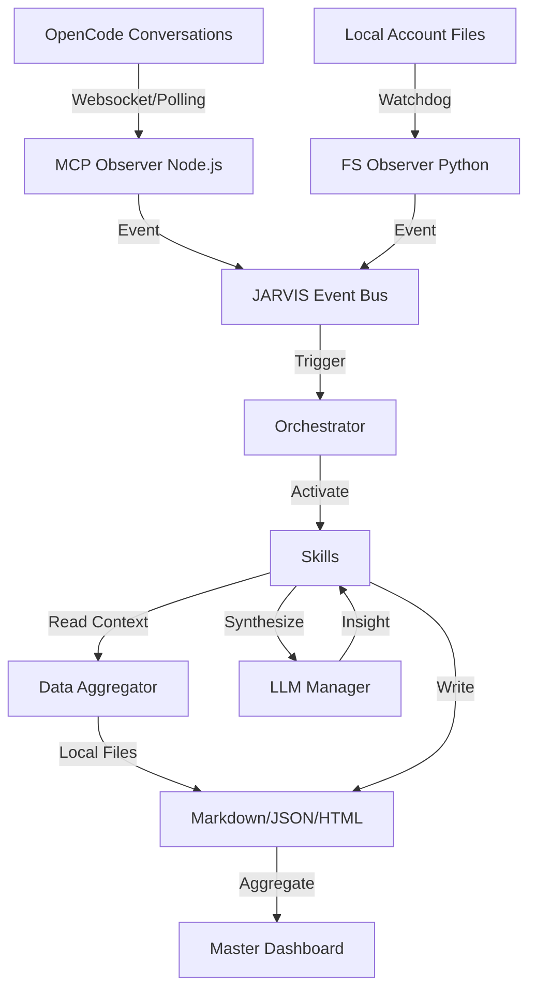

# JARVIS Data Flow Architecture

This document describes how information moves through the JARVIS system, from external triggers to the final generated dashboards.

## The High-Level Flow

## 1. Data Ingestion (Observers)

### MCP Observer (`mcp-opencode-observer/`)
- **Source**: YourCompany OpenCode internal database.
- **Mechanism**: Node.js service polls for new messages/sessions in specific workspace IDs.
- **Output**: Publishes `CONVERSATION_UPDATED` events to the JARVIS Event Bus.

### File System Observer (`jarvis/observers/file_system_observer.py`)
- **Source**: `ACCOUNTS/` directory and `notes.json` files.
- **Mechanism**: Python `watchdog` library monitors for file creation, modification, or deletion.
- **Output**: Publishes `FILE_CHANGED` or `ACCOUNT_CREATED` events.

## 2. Coordination (Orchestrator)

The **Orchestrator** (`jarvis/core/orchestrator.py`) is the central hub.
- It maintains the dependency graph of skills.
- It listens for events and decides which skills need to run.
- It ensures that "Foundation" skills (like Discovery) run before "Dependent" skills (like ROI or Dashboard).

## 3. Intelligence (Skills & LLM)

Each **Skill** parses the raw incoming data and combines it with existing account context.
- **Context Gathering**: Skills use `jarvis/utils/data_aggregator.py` to read state from other generated files.
- **Synthesis**: If configured, skills send data to the `LLMManager` (using NVIDIA/OpenAI) to generate human-like summaries and risk assessments.
- **Rule-Based Fallback**: If LLM is unavailable, skills use template-based logic to extract key facts.

## 4. Output (Persistence & UI)

- **Markdown Documents**: The primary output of most skills. These are stored directly in the account's subfolder.
- **JSON Metadata**: Used for machine-readable state tracking (e.g., `activities.jsonl`).
- **HTML Dashboard**: The `AccountDashboardSkill` aggregates all findings into a single, high-fidelity `DASHBOARD.html` file with interactive components and export options.

## 5. Feedback Loop

JARVIS is **self-actualizing**. When a skill writes a new file, the File System Observer detects it, potentially triggering other dependent skills. This ensures that the entire document suite remains internally consistent.
